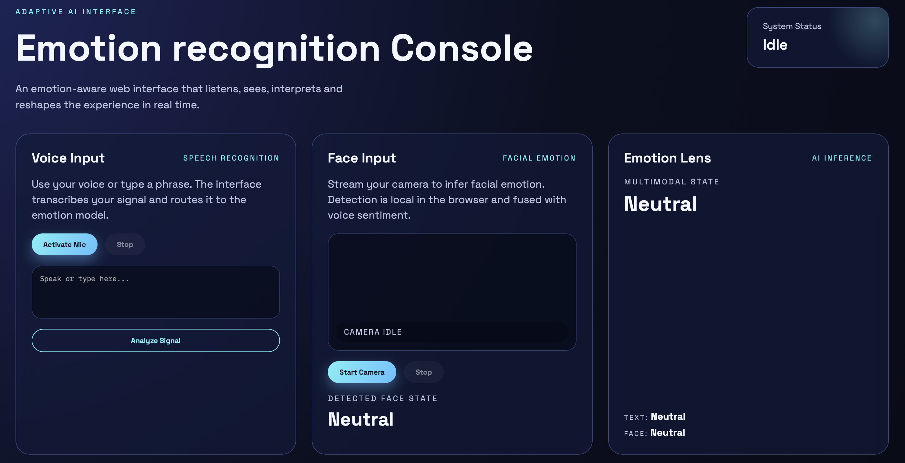

# Neural HCI Console

AI-inspired multimodal web interface that fuses speech and facial emotion cues in real time.



## Architecture

The system is split into a lightweight Python backend and an AI-driven frontend:

- **Speech emotion (text)**: The browser captures speech via Web Speech API and sends the transcript to Flask. The backend runs a naive Bayes text model trained on seed phrases (`app.py`).
- **Facial emotion (vision)**: The browser runs `face-api.js` locally. It detects a face and returns expression scores without sending video to the server (`static/js/app.js`).
- **Multimodal fusion**: The backend combines text and face scores with a weighted late-fusion strategy (default 0.6 text / 0.4 face) and returns fused labels and scores.

Data flow:

1. Speech recognition or typing produces text.
2. The camera stream is analyzed locally for expressions.
3. Frontend sends `text` + `face_scores` to `/analyze`.
4. Flask fuses the scores and responds with a multimodal label.
5. The UI updates the state, bars, and recent history.

## Run

```bash
python3 -m venv .venv
source .venv/bin/activate
pip install -r requirements.txt
python app.py
```

Open http://127.0.0.1:5000 in a browser.

## Project Structure

```
app.py                 # Flask server + text model + fusion
templates/index.html   # UI layout
static/css/style.css   # Styling and layout
static/js/app.js       # Speech, camera, face detection, UI logic
assets/interface.png   # Screenshot used in README
requirements.txt       # Python dependencies
```

## Notes

- Speech recognition uses the browser Web Speech API; it works best in Chromium-based browsers.
- Emotion detection runs locally in Python using a lightweight naive Bayes model.
- Facial emotion uses `face-api.js` via CDN; the browser will request camera access.
